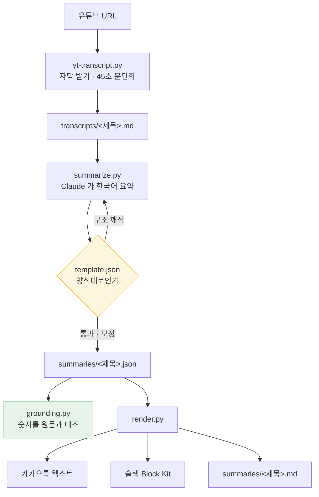

# yt-transcript-extractor

유튜브 URL 하나로 **자막 추출 → 한국어 요약 → 메신저용 렌더링**까지 한 번에.

```bash
python3 yt-transcript.py "https://www.youtube.com/watch?v=VIDEO_ID"
```

> 왜 이런 구조인지는 [`architecture.md`](architecture.md) 에 있다. 이 문서는 **무엇이 일어나고 무엇을 쓸 수 있는지**만 적는다.

---

## 무엇이 일어나나



`yt-transcript.py` 하나를 실행하면 **자막 → 요약 → 읽기용 md** 까지 자동으로 이어진다. `grounding.py` 와 슬랙·카카오톡 렌더링은 따로 부른다.

---

## 무엇이 나오나

| 파일 | 내용 |
| --- | --- |
| `transcripts/<제목>.md` | 영상 **원본 언어** 자막. 45초 문단, 타임스탬프 점프 링크 |
| `summaries/<제목>.json` | **한국어** 요약 정본 (항목별 구조) |
| `summaries/<제목>.md` | 한국어 요약 읽기용 문서 |

같은 URL 을 다시 돌리면 세 파일 모두 덮어쓴다. 덮어쓴 경우 `[완료]` 대신 `[덮어씀]` 으로 표시된다.

`summaries/`, `transcripts/` 는 개인 산출물이라 저장소에 올리지 않는다(`.gitignore`, 폴더만 `.gitkeep` 으로 유지). **예시 한 건만 예외로 포함돼 있다** — 40분짜리 한국어 기술 강연(옵시디언 × Claude Code)의 자막 55문단과 그 요약으로, 위 세 파일이 실제로 어떤 모양인지 바로 볼 수 있다.

자막 문단은 이런 모양이다.

```markdown
[`00:01:28`](https://www.youtube.com/watch?v=VIDEO_ID&t=88s) 45초 분량의 자막이 한 문단으로 묶여 이어진다...
```

카카오톡 렌더링 결과는 장식 기호 없이 1000자 안에 들어간다.

```
영상 제목

한 줄 결론이 여기 들어간다.

- 핵심 내용 1 (01:29)
- 핵심 내용 2 (11:41)

채널명 · 26:54
https://www.youtube.com/watch?v=VIDEO_ID
```

---

## 무엇이 필요한가

```bash
./setup.sh
```

빠진 것을 찾아 알려주고, 설치할 수 있는 것은 물어본 뒤 설치한다.

| | 용도 |
| --- | --- |
| Python 3.9+ | 전체 |
| [`yt-dlp`](https://github.com/yt-dlp/yt-dlp) | 자막 받기 |
| [`claude` CLI](https://claude.com/claude-code) — **로그인된 상태** | 요약 생성 |
| `brew` | (선택) 위 설치를 자동화할 때만 |

`setup.sh` 는 설치 여부뿐 아니라 **claude 로그인까지 실제 호출로 확인한다.** 설치돼 있어도 로그인이 안 돼 있으면 요약 단계에서야 실패하기 때문이다. 템플릿이 읽히는지, 스크립트 문법이 멀쩡한지도 함께 본다.

| 실행 | 동작 |
| --- | --- |
| `./setup.sh` | 빠진 게 있으면 물어보고 설치 |
| `./setup.sh --check` | 설치하지 않고 진단만 |
| `./setup.sh --yes` | 묻지 않고 설치 |
| `./setup.sh --no-probe` | 로그인 확인 호출을 건너뜀 |

바로 쓸 수 있으면 종료 코드 `0`, 빠진 게 있으면 `1` 이다.

요약은 `ANTHROPIC_API_KEY` 없이 `claude` CLI 를 헤드리스(`-p`)로 호출해 만든다. API 키 방식으로 바꾸려면 `summarize.py` 의 `call_model()` 하나만 교체하면 된다.

---

## 어떻게 쓰나

### 파이프라인 한 번에

```bash
python3 yt-transcript.py "<유튜브 URL>"
```

| 옵션 | 설명 | 기본값 |
| --- | --- | --- |
| `--lang` | `orig`(원본 언어 자동 탐지) 또는 언어 코드(쉼표 구분) | `orig` |
| `--format` | `md` / `json` / `both` | `md` |
| `--chunk` | N초 단위로 문단화 (0이면 원본 세그먼트 유지) | `45` |
| `--outdir` | 자막 출력 디렉터리 | `transcripts` |
| `--summary-dir` | 요약 출력 디렉터리 | `summaries` |
| `--model` | 요약에 쓸 모델 | `claude-opus-5` |
| `--template` | 요약 양식 파일 | `template.json` |
| `--extract N` | 요약 전에 중요 문단 N개만 선별 | off |
| `--no-summary` | 자막만 뽑고 멈춤 | off |
| `--no-auto` | 자동 생성 자막 제외, 수동 자막만 | off |
| `--from-json` | 이미 뽑은 `.json` 재가공 (네트워크 요청 없음) | - |

```bash
# 한국어 번역 트랙을 그대로 받고 싶을 때
python3 yt-transcript.py "$URL" --lang ko

# 나중에 재가공할 수 있게 json 까지 저장
python3 yt-transcript.py "$URL" --format both

# 이미 뽑은 json 으로 문단 길이만 바꿔 재생성 (429 회피)
python3 yt-transcript.py --from-json "transcripts/제목.json" --chunk 90

# 결과를 나란히 비교
python3 yt-transcript.py "$URL" --outdir orig
python3 yt-transcript.py "$URL" --outdir ko --lang ko
```

### 단계별로 따로

```bash
# 요약만 다시
python3 summarize.py "transcripts/<제목>.md" --outdir summaries

# 메신저용 렌더링
python3 render.py "summaries/<제목>.json" --to kakao          # 순수 텍스트
python3 render.py "summaries/<제목>.json" --to slack          # Block Kit (핵심)
python3 render.py "summaries/<제목>.json" --to slack-thread   # Block Kit (상세)
python3 render.py "summaries/<제목>.json" --to md -o out.md

# 숫자 대조 검증
python3 grounding.py "summaries/<제목>.json" [--window 90] [--verbose]

# 중요 문단만 선별해 보기
python3 extract.py "transcripts/<제목>.md" --top 12
```

표준출력으로 나가므로 그대로 파이프할 수 있다.

```bash
python3 render.py "summaries/<제목>.json" --to slack \
  | curl -sX POST -H 'Content-type: application/json' -d @- "$SLACK_WEBHOOK_URL"
```

---

## 요약은 어떤 모양인가

요약은 완성된 글이 아니라 **항목별 구조**로 저장되고, 채널 형식은 보내기 직전에 입힌다.

| 필드 | 내용 | 어디까지 나가나 |
| --- | --- | --- |
| `headline` | 한 줄 결론 (~100자) | 카톡 미리보기 · 슬랙 알림 |
| `key_points[]` | 핵심 3~5개 (각 ~90자) | **카카오톡은 여기까지** |
| `sections[].points[]` | 주제별 상세 | 슬랙 스레드 · `.md` |
| `entities.keywords` / `figures` | 키워드, 언급된 수치 | 라우팅 · 필터링용 |
| `disclaimer` | 주의 문구 (해당될 때만) | 전 채널 |

모든 항목에 `t`(초)가 붙는다. 점프 링크 생성과 원문 대조에 함께 쓰인다.

`source` 에는 출처가 남는다 — 원본 자막 경로, 자막 트랙 언어, 사용 모델, 템플릿 버전(`youtube-summary-ko@1`), 부분 요약이면 선별 개수.

---

## 무엇이 강제되나

### 양식 — `template.json`

형식 규칙은 코드가 아니라 파일 하나에 있고, 세 단계가 모두 그 파일을 읽는다.

```
template.json
   ├─ rules, schema  → summarize.py 가 프롬프트를 만든다
   ├─ limits         → summarize.py 가 결과를 검사·보정한다
   └─ channels       → render.py 가 카카오톡·슬랙 한도로 쓴다
```

강제되는 값: `key_points` 3~5개 · `sections` 3~6개 · 섹션당 `points` 2~7개 · `headline` 100자 · 핵심 항목 90자 · 카카오톡 1000자 · 슬랙 블록 3000자.

`--template my.json` 으로 갈아끼우면 프롬프트·검증·렌더가 함께 따라온다.

| 템플릿 | `key_points` | `sections` | 카카오톡 |
| --- | --- | --- | --- |
| 기본 | 5개 | 6개 | 595자 (한도 1000) |
| 변형 (2~3 / 1~2 / 400자) | 3개 | 2개 | 386자 (한도 400) |

### 위반 처리

프롬프트는 부탁이지 강제가 아니므로, 받은 결과를 검사한다.

| 종류 | 처리 | 예 |
| --- | --- | --- |
| **구조 깨짐** | 무엇이 틀렸는지 되먹여 **재생성**(최대 3회) | `key_points` 가 배열 아님, `text`/`points` 누락, `t` 해석 불가 |
| **개수·범위 초과** | 맞춰 자르고 **무엇을 손댔는지 출력** | 8개 → 5개, `t=999999` → 영상 길이로 클램프 |

`python3 tests/verify_template.py` 로 위반 10종을 주입해 확인한다.

```
key_points 8개 (규칙 3~5개)      보정        md:ok kakao:ok slack:ok
key_points[0].text 누락          차단(재시도)  -
sections[0].points 누락          차단(재시도)  -
t=999999 (영상 길이 밖)           보정        md:ok kakao:ok slack:ok
key_points 가 배열이 아닌 문자열    차단(재시도)  -
```

### 숫자 — `grounding.py`

요약에 나온 숫자를 `t` 시점 앞뒤 자막과 대조한다. **LLM 을 쓰지 않으므로 결과가 항상 같다.**

표기가 달라도 같은 값으로 인식한다.

| 요약 표기 | 원문 표기 | 정규화 |
| --- | --- | --- |
| `90K` | `the 90ks` (구어체 복수형) | 90000 |
| `5,140억 달러` | `514 billion dollar` | 514000000000 |
| `76.5K` | `76.5K의롱` (조사가 단위에 붙음) | 76500 |
| `10M` | `10밀리언` (영어 자릿수 음차) | 10000000 |
| `5천만원` / `3억 5천만` | — | 복합·연속 단위 합산 |
| `0.618` | `618` (앞의 `0.` 을 빼고 말함) | 별칭으로 함께 인정 |
| `68~70K` | — | 앞 숫자에도 단위 적용 |

`10월`, `16일` 처럼 날짜·시각의 숫자는 주장으로 세지 않는다.

판정은 세 가지다 — **근거 있음** / **구간 밖**(영상 다른 지점에 있음) / **원문에 없음**.

### 강제되지 않는 것

화자 귀속 문체(`~라고 주장한다`), 전사 오류 교정, 번역 품질은 프로그램으로 검사할 수 없어 프롬프트에만 의존한다. 개수 **미달**은 영상이 짧으면 정당할 수 있어 경고만 남긴다.

---

## 무엇으로 이뤄져 있나

| 파일 | 하는 일 |
| --- | --- |
| `yt-transcript.py` | 전체 진행 지휘 · 자막 받기 · 문단화 |
| `template.json` | 요약 양식과 규칙 — **형식의 단일 출처** |
| `template.py` | 양식 파일을 읽어 프롬프트·한도로 나눠줌 |
| `summarize.py` | Claude 호출 · 양식 검사 · 보정 |
| `grounding.py` | 숫자를 원문과 대조 (LLM 없음) |
| `render.py` | 카카오톡 / 슬랙 / 마크다운 변환 |
| `extract.py` | (선택) TextRank 로 중요 문단 선별 |
| `tests/verify_template.py` | 양식 강제 동작 검증 |
| `setup.sh` | 실행 환경 점검 · 부족한 도구 설치 |

---

## `--extract` 는 기본이 꺼져 있다

20분 영상으로 잰 결과다.

| | 전체 자막 | TextRank 12문단 |
| --- | --- | --- |
| 모델 입력 | 21,508자 | 9,874자 (−54%) |
| 미근거 수치 | 0건 | 0건 |
| 요약에 담긴 고유 수치 | 27개 | 19개 (**−30%**) |

문단 변별력도 언어에 따라 크게 다르다.

| 자막 언어 | 최고/최저 | 표준편차/평균 |
| --- | --- | --- |
| 한국어 (27분) | 6.10배 | 21.8% |
| 한국어 (8분) | 2.46배 | 21.1% |
| **영어 (20분)** | **1.34배** | **7.5%** |

영어 자막에서는 문단이 고만고만하게 닮아 선별이 거의 무작위에 가깝다. **전체 자막이 부담스러운 길이에서만 쓸 것.** 일부만 보고 만든 요약은 렌더된 `.md` 맨 아래에 그 사실이 표시된다.

---

## 무엇을 못 하나

- **자막 트랙이 없는 영상**은 처리할 수 없다. 음성을 받아 Whisper 등으로 STT 를 돌려야 한다.
- **호출마다 결과가 달라진다.** 양식으로 모양은 고정되지만 문장은 매번 다르다. `temperature=0` 은 답이 아니다 — 완전 재현성을 보장한 적이 없고 Opus 5 에서는 파라미터 자체가 제거돼 보내면 400 이다. 같은 입력에 같은 출력이 필요하면 자막 해시로 캐싱해 호출을 건너뛰어야 한다.
- **자동 발송은 사람이 중간에 보지 않는다.** 숫자 대조와 타임스탬프가 사실상 유일한 안전장치다.

---

## 더 읽을 것

- [`architecture.md`](architecture.md) — 이 파이프라인을 **비개발 언어**로 설명한 문서. 각 단계에서 무슨 일이 일어나는지, 왜 그렇게 정했는지.
