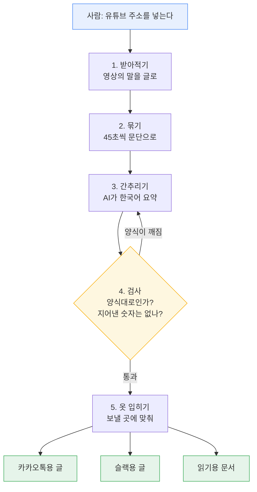
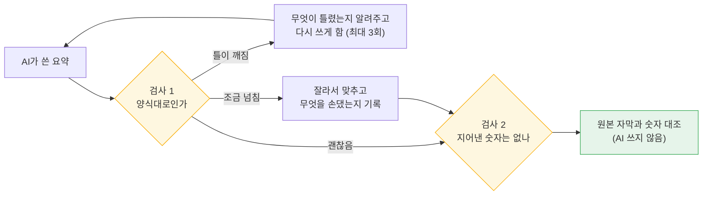
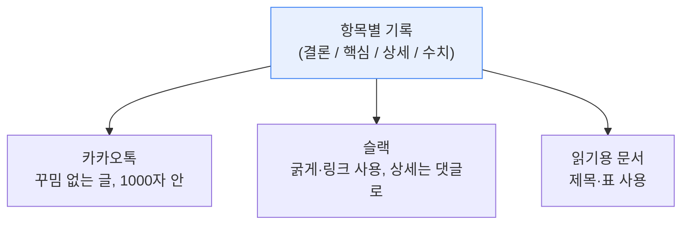
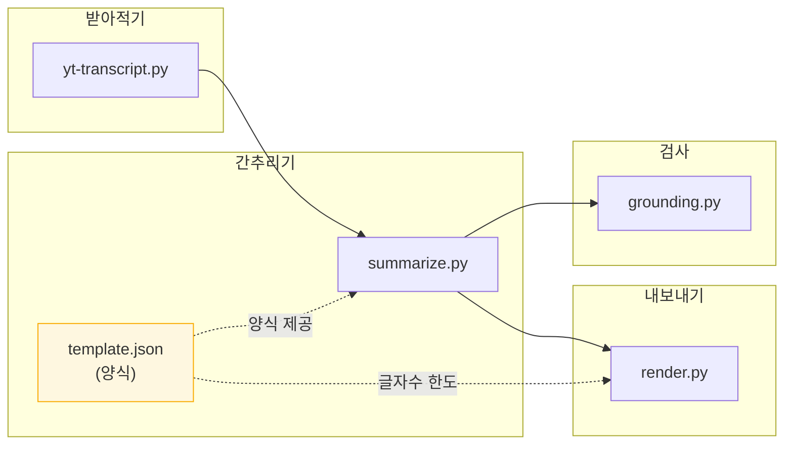

# 이 도구는 어떻게 동작하나

유튜브 주소 하나를 넣으면 한국어 요약이 나옵니다. 그 사이에 무슨 일이 일어나는지를, 개발 지식 없이 읽을 수 있게 정리한 문서입니다.

---

## 한 문장으로

> **영상이 한 말을 받아적고 → 한국어로 간추린 뒤 → 지어낸 말이 없는지 검사해서 → 메신저로 보낼 수 있는 모양으로 내놓습니다.**

---

처음 쓴다면 `./setup.sh` 를 먼저 실행하면 됩니다. 필요한 프로그램이 갖춰졌는지 확인하고, 빠진 것은 설치할지 물어봅니다.

---

## 전체 여정



---

## 단계별로 무슨 일이 일어나나

### 1단계 — 받아적기

유튜브에는 이미 자동 자막이 들어 있습니다. 그걸 그대로 가져옵니다. 사람이 다시 듣고 타이핑할 필요가 없습니다.

**여기서 중요한 선택이 하나 있습니다.** 유튜브는 한국어 번역 자막도 제공하지만, 이 도구는 **영상에서 실제로 말한 언어 그대로** 가져옵니다.

왜냐하면 유튜브 번역은 **2초짜리 조각을 앞뒤 맥락 없이** 옮기기 때문입니다. 실제로 이런 오역이 나왔습니다.

| 실제로 한 말 | 유튜브 번역 | 올바른 뜻 |
| --- | --- | --- |
| October low | 10월 최저 **기온** | 10월 **저점** (가격) |
| $90k | **90km/h** | 9만 **달러** |

번역본을 요약하면 이 오류가 그대로 굳어버립니다. 요약하는 쪽은 원문을 볼 수 없으니 되돌릴 방법도 없습니다. **그래서 번역은 뒤에서, 전체를 다 읽은 다음에 합니다.**

### 2단계 — 묶기

자동 자막은 2초마다 한 조각씩 끊겨 있어서 그대로는 읽기 어렵습니다. **45초씩 모아 한 문단으로** 만듭니다.

각 문단에는 **"영상 몇 분 몇 초 지점"** 이라는 꼬리표가 붙습니다. 이 꼬리표가 나중에 두 가지 일을 합니다.

- 요약을 읽다가 궁금한 대목을 누르면 **영상의 그 지점으로 바로 이동**
- **"이 요약이 맞는지" 원본과 대조할 때의 좌표** (4단계에서 씁니다)

### 3단계 — 간추리기

여기서 AI 가 등장합니다. 문단들을 다 읽고 한국어 요약을 씁니다.

**어떤 AI를 쓸지는 고를 수 있습니다.** 기본은 컴퓨터에 설치된 Claude 를 그대로 쓰는 것이라 별도의 열쇠(API 키)가 필요 없습니다. 다른 회사의 AI 를 쓰고 싶으면 `.env` 라는 설정 파일에 **주소 · 열쇠 · 모델 이름** 세 줄만 적으면 됩니다. 코드는 건드리지 않습니다. 뒤에 올 검사 단계는 어떤 AI를 쓰든 똑같이 작동합니다.

AI가 자유롭게 쓰게 두지 않습니다. **미리 정해둔 빈칸 양식**을 주고 그 안에서만 쓰게 합니다.

```
한 줄 결론      ← 100자 이내
핵심 3~5개      ← 각 90자 이내
주제별 상세      ← 3~6개 묶음
언급된 수치      ← 목표가, 비율 등
주의 문구        ← 투자·의료 내용일 때만
```

양식에는 글쓰기 규칙도 함께 들어 있습니다. 그중 가장 중요한 것:

> **"영상 속 주장은 사실이 아니라 화자의 말이다. `~라고 주장한다`로 쓰고, `~이다`로 단정하지 마라."**

요약이 자동으로 남에게 전달되는 글이기 때문입니다. 화자의 전망을 단정형으로 옮기면 **보낸 사람의 주장이 되어버립니다.**

또 하나: AI에게는 요약 본문만 맡깁니다. 영상 제목·주소·길이 같은 건 **기계가 직접 읽어서 채웁니다.** 틀릴 수 있는 일을 굳이 AI에게 시키지 않습니다.

### 4단계 — 검사 (두 종류)

AI에게 "이렇게 써라"라고 말하는 것은 **부탁이지 강제가 아닙니다.** 그래서 받은 결과를 반드시 검사합니다.



**검사 1 — 양식을 지켰나**

- **틀이 깨진 경우** (핵심 항목에 내용이 없다든가): 무엇이 잘못됐는지 알려주고 다시 쓰게 합니다.
- **조금 넘친 경우** (핵심을 5개가 아니라 8개 썼다든가): 잘라서 맞추고, **무엇을 잘랐는지 반드시 남깁니다.** 조용히 줄이면 "다 담았다"고 오해하게 되니까요.

**검사 2 — 지어낸 숫자는 없나**

가장 위험한 거짓말은 **없는 숫자**입니다. 목표가나 비율을 지어내면 읽는 사람이 그대로 믿습니다.

그래서 요약에 나온 숫자마다, **2단계에서 붙여둔 시간 꼬리표를 좌표 삼아** 그 지점 앞뒤 자막을 꺼내 **실제로 그 숫자가 나오는지** 대조합니다. **이 검사에는 AI를 쓰지 않습니다.** 계산만 하므로 항상 같은 결과가 나오고, 검사기가 또 거짓말할 걱정이 없습니다.

말과 글의 표기가 달라도 같은 값으로 알아봅니다.

| 요약에 쓴 것 | 영상에서 말한 것 |
| --- | --- |
| `9만 달러` | `the 90ks` |
| `5,140억 달러` | `514 billion` |
| `10M` | `10밀리언` |
| `0.618` | `618` (앞의 `0.`을 빼고 말함) |

### 5단계 — 옷 입히기

요약은 **완성된 글이 아니라 항목별로 나뉜 기록**으로 저장됩니다. 보내기 직전에 목적지에 맞춰 모양을 만듭니다.



세 곳의 글쓰기 규칙이 전부 다릅니다. 카카오톡은 굵게도 링크 꾸밈도 없어서 장식 기호를 쓰면 그대로 `*이렇게*` 보입니다. 슬랙은 나름의 표기법이 있고요.

**완성된 글로 저장했다면** 보낼 곳이 늘 때마다 AI에게 다시 요약을 시켜야 하고, 그러면 카카오톡 버전과 슬랙 버전의 내용이 서로 달라집니다. 항목별로 저장해두면 **모양만 다시 입히면 됩니다.**

---

## 왜 이렇게 만들었나 — 세 가지 판단

### 하나. 번역은 마지막에

앞서 본 `10월 최저 기온` 오역 때문입니다. 조각조각 번역하면 틀리고, 틀린 걸 요약하면 되돌릴 수 없습니다. **전체를 읽은 다음 한 번에 옮기면** 이런 오역이 생기지 않습니다.

### 둘. 양식을 파일 하나로

요약의 형식 규칙(몇 개를 쓸지, 몇 자로 쓸지)은 **파일 한 개**에 모여 있습니다. AI에게 주는 지시문, 결과 검사, 메신저 글자 수 제한이 **모두 그 파일을 봅니다.**

예전에는 규칙이 여러 군데 흩어져 있었습니다. "핵심은 3~5개"라는 말이 지시문에도 있고 검사 코드에도 따로 있었죠. **한쪽만 고치면 조용히 어긋납니다.** 한 곳으로 모으니 한 번만 고치면 전부 따라옵니다.

### 셋. AI를 믿지 않고 검사

AI 요약에는 두 가지 약점이 있습니다.

| 약점 | 이 도구의 대응 |
| --- | --- |
| 없는 사실을 지어낼 수 있다 | 숫자를 원본과 대조 (AI 없이) |
| 부를 때마다 결과가 달라진다 | 양식으로 모양은 고정. 내용까지 똑같게 하려면 결과를 저장해두고 재사용 |

---

## 실제로 재본 결과

세 편의 영상(20분 영어, 27분 한국어, 8분 한국어)으로 확인했습니다.

| 확인한 것 | 결과 |
| --- | --- |
| 요약의 숫자가 원본에 실제로 있나 | **지어낸 숫자 0건** |
| 양식을 어긴 결과가 들어오면 | 10가지 경우 모두 차단 또는 자동 보정 |

**다만 여기서 배운 게 하나 더 있습니다.** 처음 검사를 돌렸을 때는 "지어낸 것 같다"가 22%, 50%로 나왔습니다. 하지만 하나씩 확인해보니 **전부 검사기 쪽 실수**였습니다. 영상에서 `the 90ks`라고 말한 걸 검사기가 `90`으로만 읽어서, 요약의 `9만 달러`와 다르다고 판정한 식이었습니다.

> **검사 도구를 만들면, 처음 나온 경고는 AI 잘못보다 도구 잘못일 가능성이 높습니다.** 그대로 믿고 "할루시네이션 22%"라고 결론 냈다면 완전히 틀린 이야기가 됐을 겁니다.

---

## 파일 지도

각 파일이 여정의 어느 부분을 맡는지입니다.

| 파일 | 하는 일 | 여정 단계 |
| --- | --- | --- |
| `yt-transcript.py` | 전체 진행을 지휘하고, 자막을 받아적어 문단으로 묶음 | 1·2 |
| `template.json` | 요약의 빈칸 양식과 규칙 — **형식의 유일한 출처** (`template.py` 가 이 파일을 읽어 나눠줍니다) | 3·4 |
| `summarize.py` | AI에게 요약을 시키고, 양식대로인지 검사 | 3·4 |
| `grounding.py` | 숫자를 원본과 대조 (AI 없음) | 4 |
| `render.py` | 카카오톡·슬랙·문서 모양으로 변환 | 5 |
| `extract.py` | (선택) 긴 영상에서 중요 문단만 먼저 골라냄 | 3 앞 |
| `setup.sh` | 필요한 프로그램이 갖춰졌는지 확인하고 빠진 것을 설치 | 시작 전 |
| `.env` | (선택) 다른 회사 AI 를 쓸 때의 주소·열쇠·모델 이름 | 3 |
| `tests/verify_template.py` | 양식 검사가 실제로 작동하는지 확인 | 4 |



양식 파일(`template.json`)이 요약과 내보내기 **양쪽에 점선으로 연결된 것**이 핵심입니다. 한 곳에서 형식을 정하고 여러 단계가 그걸 따릅니다.

---

## 못 하는 것

솔직하게 적어둡니다.

- **자막이 아예 없는 영상은 처리할 수 없습니다.** 음성을 따로 받아 글로 바꾸는 단계가 필요합니다.
- **말투나 번역 품질은 기계가 검사하지 못합니다.** 숫자는 대조할 수 있지만 `~라고 주장한다` 같은 규칙은 지켰는지 확인할 방법이 없어, AI에게 부탁하는 수준에 머뭅니다.
- **자동 발송은 사람이 중간에 보지 않습니다.** 숫자 대조와 시간 꼬리표가 사실상 유일한 안전장치입니다.
- **긴 영상에서 중요 부분만 고르는 기능**은 있지만 기본으로 꺼져 있습니다. 20분 영상으로 재보니 내용의 30%를 잃는 데 비해 얻는 게 없었습니다.
